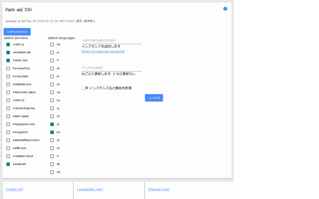

# Masto and DON
Firefox plugin using web extensions.

[Official Page](https://addons.mozilla.org/en-US/firefox/user/novice_yamato/)

## What it does
This plugin provides public timeline viewer for mastodon instances.

## Links
This plugin depends on following projects.

- https://fonts.googleapis.com
- https://getmdl.io
- https://github.com/material-components/material-components-web
- https://github.com/maxthet604/material-timeline
